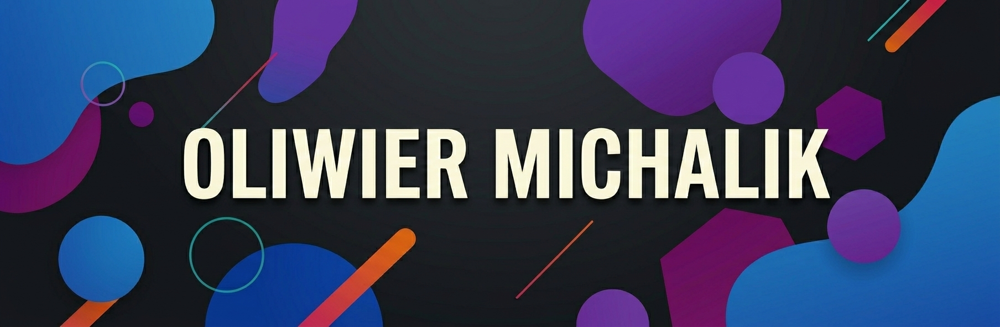

## Hi There! I'm [Oliwier](https://github.com/olix3001)! :wave:

I'm a full-stack developer and student at Wrocław University of Science and Technology.
I've been learning programming since primary school, and recently I also picked up some electronics.

I don't just like to use the programming languages, I like to build my own. I'm fascinated by compilers, graphics programming and other 'under the hood' stuff.
Apart from those, I also build full-stack web apps that bring powerful backend infrastructure with modern, intuitive UI/UX design.

Lately I've picked up some new hoobies, that include mentioned earlier electronics and circuit board design, as well as event tech, including PA Systems, Stage Lighting, and DJing.

---
### :computer: Talking about tech
Here are some example tools and languages I use on daily basis:

<code></code>
<code></code>
<code></code>
<code></code>
<code></code>
<code></code>
<code></code>
<code></code>
<code></code>
<code></code>
<code></code>
<code></code>

### :memo: What I'm working on?
- Competitive coding platform called [xContest](https://github.com/xcontest),
- My personal website [oliwiermichalik.xyz](https://oliwiermichalik.xyz/) [W.I.P.].

---

### :bar_chart: Some stats for fun

  
<b>Github Streak</b>

   
  

  
<b>Github User Statistics</b>

   
  

---
### :phone: Contact
If you want to contact me, the preferred way is to create
issue on [this readme's](https://github.com/olix3001/olix3001/issues) repository.

You can also contact me via email (this email will change soon): olix3001@gmail.com

---
### :coffee: Like my work?
*Buy me a coffee or Ko-Fi link will appear here soon*